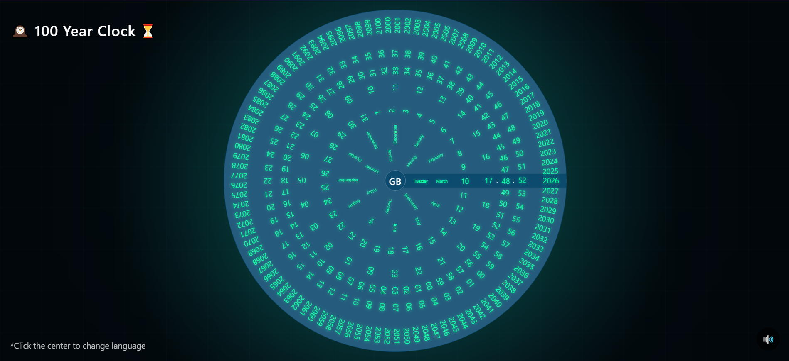
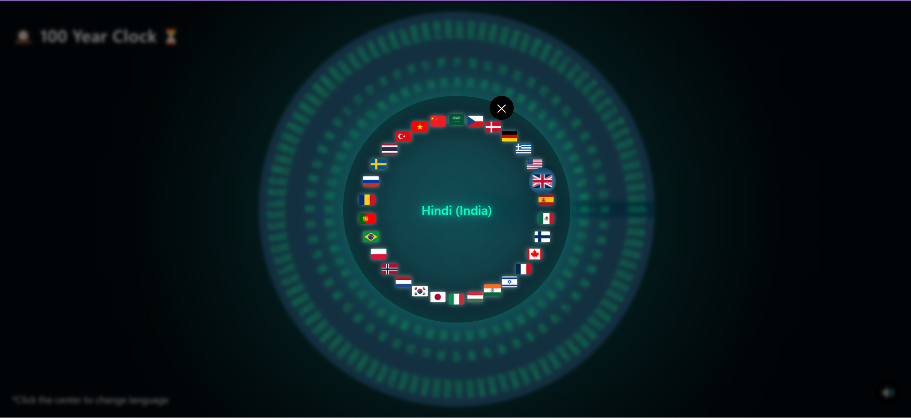

# 🕰️ 100 Year Clock Wheel

A futuristic **visual time wheel** that represents time across multiple scales — seconds, minutes, hours, days, months, and years — arranged in rotating circular rings.

This project creates a **dynamic radial clock interface** where time is displayed as rotating rings instead of traditional linear digits.

---

# ✨ Features

* 🌀 **Radial Time Visualization**
  Time is displayed as circular rings instead of a traditional clock.

* ⏱ **Multi-layer Time System**

  * Seconds
  * Minutes
  * Hours
  * Days
  * Months
  * Years (100 year range)

* 🌍 **Multi-Language Support**

  * Language selector using flags
  * Localized weekday and month names

* 🎧 **Ambient Clock Sound**

  * Optional ticking sound with toggle button

* 🎨 **Futuristic UI**

  * Neon glow typography
  * Sci-fi radial gradients
  * Subtle grid background

* 📱 **Responsive Design**

  * Works on desktop and mobile

---

# 📸 Preview




---

# 🧠 How It Works

The clock renders multiple **concentric rings**.

Each ring represents a different time unit.

Example structure:

| Ring       | Data     |
| ---------- | -------- |
| Outer Ring | Years    |
| Next       | Seconds  |
| Next       | Minutes  |
| Next       | Hours    |
| Next       | Days     |
| Next       | Months   |
| Inner      | Weekdays |

Each ring rotates based on the **current system time**.

Rotation is calculated using:

```
rotation = -(currentValue / totalValues) * 360
```

The rings update using `requestAnimationFrame()` for smooth animation.

---

# 🌍 Language System

Languages are automatically detected using:

```
navigator.languages
navigator.language
```

Users can also change language manually using the **center selector**.

Supported features:

* Country flags
* Localized weekday names
* Localized month names

Example:

```
Tuesday  March  10  17 : 40 : 22
```

---

# 🎵 Audio System

The clock includes optional ticking audio.

Controls:

* 🔊 Toggle sound on/off
* Looping background tick sound

```
<audio id="clock-audio" src="clockticking.mp3" loop preload="auto"></audio>
```

---

# 🖥️ Project Structure

```
100-year-clock/
│
├── index.html
├── style.css
├── script.js
├── clockticking.mp3
├── preview.png
├── language.png
├── LICENSE
└── README.md
```

---

# ⚙️ Installation

Clone the repository:

```
git clone https://github.com/singhmohit7057/100-year-clock.git
```

Open the project:

```
cd 100-year-clock
```

Run locally by opening:

```
index.html
```

No build tools required.

---

# 🚀 Future Improvements

Possible enhancements:

* 🌌 Animated radar sweep effect
* 🧬 Smooth ring transitions
* ⌛ User lifespan visualization
* 🌍 More language support
* 📊 Life progress indicator
* 🎨 Theme switching (dark / neon / minimal)

---

# 📜 License

MIT License

You are free to use, modify, and distribute this project.

---

# 👨‍💻 Author

Created by **Mohit Singh**

If you like this project, consider ⭐ starring the repository.

---
